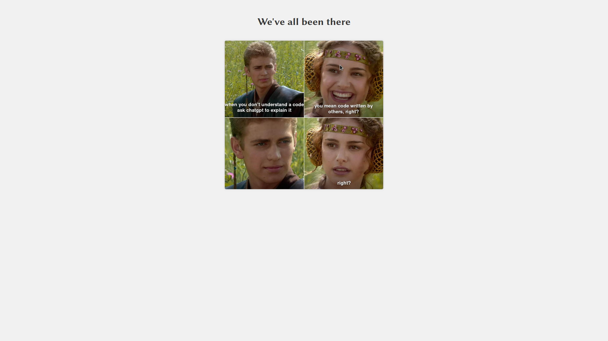

# random_meme_reddit 

# ScreenShots 

 
  

Flask Web Application for Random Programmer Humor Post

This Python code demonstrates a Flask web application that fetches a random post from the "ProgrammerHumor" subreddit and displays the post's title and URL on a webpage.

Dependencies:
- Flask: A Python web framework for building web applications.

Code Explanation:
1. Importing necessary modules:
   - Flask: Used to create the Flask application.
   - render_template: Used to render an HTML template.
   - requests: Used to send HTTP requests and retrieve responses.
   - json: Used to parse JSON data.
   - random: Used to generate random values.

2. Creating a Flask application:
   - app = Flask(__name__): Creates a Flask application instance.

3. Defining a route and function:
   - @app.route("/"): Associates the URL route "/" with the following function.
   - def index(): The function that will be executed when the "/" route is accessed.

4. Fetching data from Reddit:
   - url = "https://www.reddit.com/r/ProgrammerHumor/random.json": Specifies the URL to fetch random posts from the "ProgrammerHumor" subreddit.
   - headers = {"User-Agent": "Mozilla/5.0"}: Specifies the user-agent header to send with the HTTP request.
   - response = requests.get(url, headers=headers): Sends an HTTP GET request to the specified URL and stores the response.

5. Processing the response:
   - Checks if the request was successful using response.status_code.
   - Parses the JSON data from the response and extracts the post's title and URL.

6. Rendering the template:
   - Returns the rendered HTML template "index.html" with the post's title and URL.

HTML Template:
- The provided HTML template contains a simple webpage structure.
- It displays the post's title and an image sourced from the URL.

Author: 
- Namous Nassim

Usage:
- Ensure Flask and the required dependencies are installed.
- Run the Python script.
- Access the application through the defined host and port.

Flask Web Application for Random Programmer Humor Post

This Python code demonstrates a Flask web application that fetches a random post from the "ProgrammerHumor" subreddit and displays the post's title and URL on a webpage.

Dependencies:
- Flask: A Python web framework for building web applications.

Code Explanation:
1. Importing necessary modules:
   - Flask: Used to create the Flask application.
   - render_template: Used to render an HTML template.
   - requests: Used to send HTTP requests and retrieve responses.
   - json: Used to parse JSON data.
   - random: Used to generate random values.

2. Creating a Flask application:
   - app = Flask(__name__): Creates a Flask application instance.

3. Defining a route and function:
   - @app.route("/"): Associates the URL route "/" with the following function.
   - def index(): The function that will be executed when the "/" route is accessed.

4. Fetching data from Reddit:
   - url = "https://www.reddit.com/r/ProgrammerHumor/random.json": Specifies the URL to fetch random posts from the "ProgrammerHumor" subreddit.
   - headers = {"User-Agent": "Mozilla/5.0"}: Specifies the user-agent header to send with the HTTP request.
   - response = requests.get(url, headers=headers): Sends an HTTP GET request to the specified URL and stores the response.

5. Processing the response:
   - Checks if the request was successful using response.status_code.
   - Parses the JSON data from the response and extracts the post's title and URL.

6. Rendering the template:
   - Returns the rendered HTML template "index.html" with the post's title and URL.

HTML Template:
- The provided HTML template contains a simple webpage structure.
- It displays the post's title and an image sourced from the URL.

Author: 
- Namous Nassim

Usage:
- Ensure Flask and the required dependencies are installed.
- Run the Python script.
- Access the application through the defined host and port.
